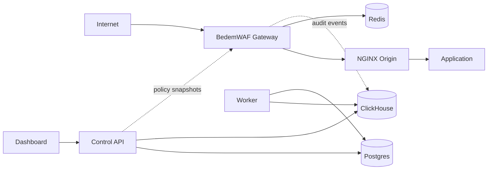

# Architecture

BedemWAF is a self-hosted managed WAF platform that protects HTTP applications
by placing a Go gateway in front of NGINX origins.

```text
Internet -> BedemWAF Gateway -> NGINX Origin -> Application
```

The gateway is the data plane. It makes per-request decisions. The control API,
dashboard, worker, and databases are the control plane. They manage
configuration, rules, search, enrichment, and retention.

## System Diagram

```text
                     Control Plane

  +-------------+        +----------------+        +------------+
  | Dashboard   |------->| Control API    |------->| Postgres   |
  | Next.js     | HTTPS  | Go REST API    |        | config DB  |
  +-------------+        +-------+--------+        +------------+
                                  |
                                  | event queries
                                  v
                            +-------------+
                            | ClickHouse  |
                            | event store |
                            +-------------+
                                  ^
                                  |
                            +-----+------+
                            | Worker     |
                            | Go jobs    |
                            +------------+

                       Data Plane

  +----------+     +-------------------+     +--------------+     +-------------+
  | Internet |---->| BedemWAF Gateway  |---->| NGINX Origin |---->| Application |
  +----------+     | Go reverse proxy  |     +--------------+     +-------------+
                   +----+---------+----+
                        |         |
                        |         +-----------> async audit event
                        v
                   +---------+
                   | Redis   |
                   | limits  |
                   +---------+
```



## Service Responsibilities

### Gateway

The gateway receives public HTTP traffic and is responsible for enforcement.

MVP responsibilities:

- Accept HTTP requests on configured listeners
- Provide a TLS termination placeholder in configuration and interfaces
- Assign a `request_id`
- Resolve the protected app by the HTTP `Host` header
- Load the active policy from an in-memory policy cache
- Evaluate IP allow/block sets
- Evaluate Redis-backed rate limits
- Run WAF inspection through Coraza and OWASP CRS-compatible rules
- Evaluate simple custom defensive rules
- Apply policy mode: `count` or `block`
- Reverse proxy allowed requests to the configured NGINX origin
- Emit redacted structured audit events asynchronously

Later-phase responsibilities:

- Real TLS certificate management
- Hot configuration streaming from the control plane
- Multi-origin load balancing and active health checks
- Response inspection where explicitly enabled
- Advanced bot and anomaly scoring controls

### Control API

The control API is the management source of truth.

MVP responsibilities:

- Manage tenants, apps, origins, policies, rule groups, custom rules, IP sets,
  rate limits, and API keys
- Store configuration in Postgres
- Expose event search APIs backed by ClickHouse
- Validate all inputs
- Provide stable REST resources and OpenAPI documentation
- Publish or expose policy snapshots for gateways

Later-phase responsibilities:

- Role-based access control
- Audit logs for administrative changes
- Policy versioning, staged rollout, and rollback
- Signed gateway configuration bundles

### Dashboard

The dashboard is a Next.js administrative UI.

MVP responsibilities:

- Authenticate operators before exposing configuration
- Manage apps, origins, policies, rule groups, IP sets, and rate limits
- Search and filter security events
- Make count-to-block rollout workflows clear

Later-phase responsibilities:

- Analytics dashboards
- Rule recommendation workflows
- Incident response views
- Multi-tenant role management

### Worker

The worker handles asynchronous control-plane and analytics jobs.

MVP responsibilities:

- Enrich audit events
- Run event retention cleanup
- Prepare rule update jobs
- Maintain derived analytics tables if needed

Later-phase responsibilities:

- Managed rule distribution
- External threat intelligence imports
- Scheduled policy reports

### Postgres

Postgres stores durable control-plane configuration:

- Tenants
- Users and API keys
- Apps and hostnames
- Origins
- Policies
- Rule groups and custom rules
- IP sets
- Rate-limit definitions

### Redis

Redis stores low-latency operational state:

- Rate-limit counters
- Short-lived locks
- Optional event queue metadata

Redis must not be treated as the durable source of policy configuration.

### ClickHouse

ClickHouse stores high-volume security and analytics events:

- WAF audit events
- IP set matches
- Rate-limit matches
- Block/count/allow decisions
- Aggregated dashboards

## Configuration Flow

```text
Operator
  |
  v
Dashboard or API client
  |
  v
Control API validates request
  |
  v
Postgres stores canonical config
  |
  v
Gateway loads policy snapshot
  |
  v
Gateway updates in-memory policy cache
```

The MVP can use polling from the gateway to the control API. Later phases can add
signed snapshots, push-based configuration, and explicit config revisions.

## Request Decision Flow

```text
request received
  |
  v
assign request_id
  |
  v
lookup app by Host
  |
  v
load active policy from cache
  |
  v
IP sets -> rate limits -> WAF engine -> custom rules
  |
  v
decision: allow, count, or block
  |
  +--> emit redacted audit event
  |
  +--> proxy to NGINX origin or return block response
```

Full details are in [Request Flow](request-flow.md).

## Safe Defaults

- New policies default to `count` mode
- Request body inspection uses explicit size limits
- Full body logging is disabled by default
- Sensitive fields are redacted before event storage
- Dashboard must be behind authentication
- API keys are scoped and stored hashed
- Unknown hosts are rejected rather than proxied to a default origin
- Direct origin exposure is treated as a deployment error

## Failure Modes

- Redis unavailable: rate-limit checks should fail according to policy
  configuration. MVP default is fail-open with an audit warning to avoid
  accidental outage, except for explicitly fail-closed critical limits.
- Policy cache stale: gateway continues using the last valid policy snapshot and
  emits stale-cache health metrics/events.
- Origin unavailable: gateway returns `502 Bad Gateway` or `504 Gateway Timeout`
  and logs an origin failure event.
- ClickHouse unavailable: gateway must not block request handling solely because
  event storage is down. Events should be queued best-effort with bounded memory.
- Control API unavailable: gateway continues using cached policies. Dashboard and
  management clients receive API errors until recovery.

## MVP Scope

- Single gateway process
- HTTP reverse proxy to NGINX origins
- Host-based app lookup
- In-memory policy cache
- Coraza/CRS-compatible WAF inspection
- Basic custom rules
- IP sets
- Redis-backed rate limits
- Redacted audit events
- Postgres-backed configuration
- ClickHouse event search

## Later-Phase Scope

- Automated TLS certificate lifecycle
- Push-based gateway config distribution
- Multi-region deployment
- Gateway autoscaling guidance
- Advanced analytics and alerting
- RBAC and SSO
- Managed rule update service
- Kubernetes and Helm deployment artifacts
