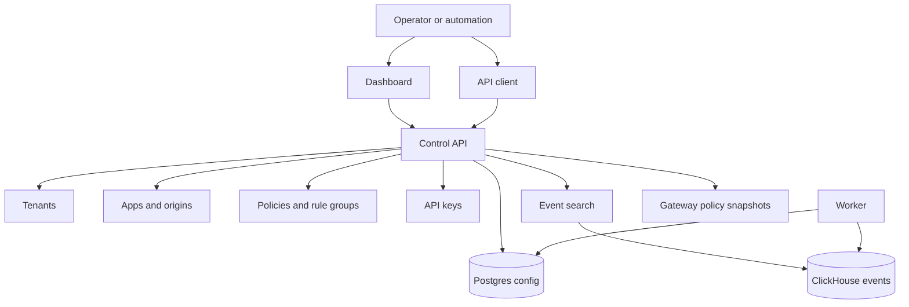

# Control Plane

The BedemWAF control plane manages configuration and visibility. It is not in
the request path for every user request, so gateway enforcement must continue
when the control plane is temporarily unavailable.

```text
Operator / Automation
        |
        v
+----------------+
| Dashboard      |
| API clients    |
+--------+-------+
         |
         v
+----------------+        +------------+
| Control API    |------->| Postgres   |
| REST / OpenAPI |        | config     |
+--------+-------+        +------------+
         |
         +--------------->+------------+
                         | ClickHouse |
                         | events     |
                         +------------+
         |
         v
+----------------+
| Gateway config |
| snapshots      |
+----------------+
```



## Control API

The control API is the canonical write path for BedemWAF configuration.

Responsibilities:

- Authenticate operators and API keys
- Authorize access by tenant and scope
- Validate all input
- Store configuration in Postgres
- Query events from ClickHouse
- Expose OpenAPI documentation
- Produce gateway-readable policy snapshots

Tenant context:

- Tenant-scoped admin routes require `X-Bedem-Tenant-ID`.
- `tenant_id` query selection is accepted only for local development when the
  header is absent.
- Apps, origins, policies, custom rules, IP sets, rate limits, and events are
  queried with tenant predicates.
- Cross-tenant reads and writes return `404 not_found` rather than revealing
  resource ownership.

MVP resources:

- Tenants
- Apps
- Origins
- Policies
- Rule groups
- Custom rules
- IP sets
- Rate limits
- Events
- API keys

## Dashboard

The dashboard is a human-facing client of the control API.

MVP responsibilities:

- Require authentication before showing any tenant data
- Show apps, policies, origins, rules, and events
- Make count mode visible and easy to promote to block mode
- Avoid exposing secrets to browser JavaScript
- Use secure headers

Later phase:

- SSO
- RBAC management
- Policy diff and approval workflows
- Analytics and reports

## Worker

The worker runs jobs that do not belong in synchronous API requests.

MVP jobs:

- Event enrichment
- Event retention cleanup
- Rule update preparation
- Derived analytics maintenance

Later jobs:

- Managed rule downloads and signature verification
- Tenant reports
- Alert delivery

## Postgres Data Ownership

Postgres stores configuration that must be durable and strongly consistent.

Primary tables to add:

- `tenants`
- `users`
- `api_keys`
- `apps`
- `app_hostnames`
- `origins`
- `policies`
- `rule_groups`
- `custom_rules`
- `ip_sets`
- `rate_limits`
- `policy_revisions`

Implementation expectations:

- Use migrations, not ad hoc schema changes.
- Add tenant ID to tenant-owned tables.
- Add created/updated timestamps.
- Store API keys hashed.
- Avoid storing operational event volume in Postgres.

## ClickHouse Event Search

ClickHouse stores high-volume audit events.

Search API requirements:

- Filter by tenant before all other filters
- Filter by app, source IP, action, rule ID, path, and time range
- Enforce time range limits for expensive queries
- Return paginated results
- Avoid exposing unredacted fields

## API Keys

API keys are for automation and gateway-to-control-plane access.

MVP behavior:

- Store only a hash of the secret
- Show plaintext only once
- Support scopes such as `events:read`, `policies:read`, `policies:write`
- Support expiration
- Record last-used timestamp

Later phase:

- Per-app API key restrictions
- Rotation workflows
- Key usage analytics

## Gateway Policy Snapshots

The gateway should consume compact policy snapshots instead of joining database
tables at request time.

Snapshot contents:

- Snapshot revision
- Tenant/app IDs
- Hostname mappings
- Origin definitions
- Active policy mode
- Rule group references
- Custom rules
- IP sets
- Rate limits
- Redaction settings

MVP can expose a polling endpoint:

```text
GET /internal/gateway/snapshot?since_revision=<rev>
```

Later phases should sign snapshots and authenticate gateways explicitly.

## Control Plane Failure Modes

- Control API unavailable: dashboard and API clients fail, gateways continue from
  cached snapshots.
- Postgres unavailable: writes fail; reads that require Postgres fail; gateways
  continue from cache.
- ClickHouse unavailable: event search fails; gateway should still accept
  traffic and queue/drop events according to data-plane policy.
- Worker unavailable: enrichment and retention lag; request enforcement is not
  affected.

## MVP Scope

- REST API shape and OpenAPI docs
- Postgres-backed configuration
- API key model
- Basic event search
- Snapshot endpoint for gateways
- Dashboard behind authentication

## Later-Phase Scope

- RBAC and SSO
- Signed snapshots
- Policy version approval
- Advanced analytics
- Alerting
- Managed rule update service
