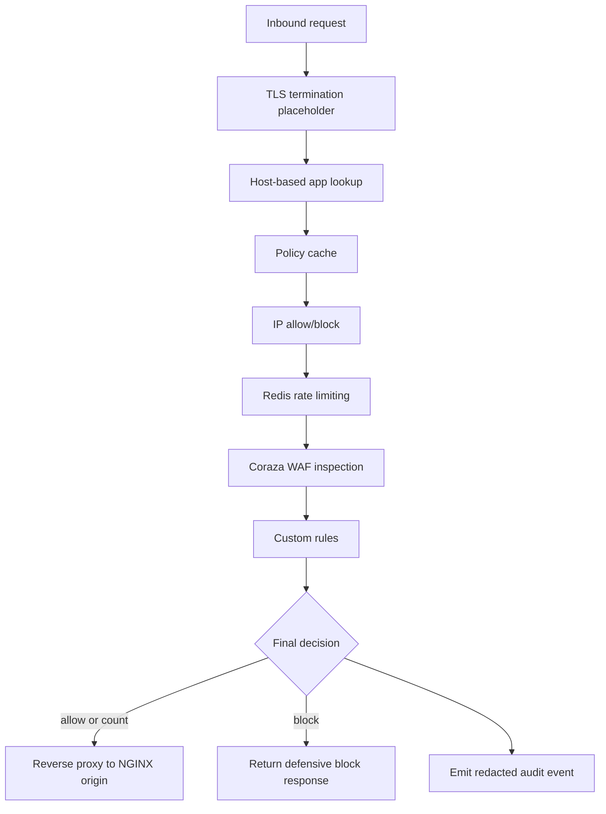

# Data Plane

The BedemWAF data plane is the gateway service. It is the only component in the
request path between the internet and protected NGINX origins.

```text
Client
  |
  v
+-------------------+
| BedemWAF Gateway  |
| data plane        |
+---+---+---+---+---+
    |   |   |   |
    |   |   |   +--> audit event emitter
    |   |   +------> WAF engine
    |   +----------> Redis rate limits
    +--------------> NGINX origin proxy
```



## Core Responsibilities

### TLS Termination Placeholder

MVP can start with HTTP listeners for local development, but the gateway should
be designed with TLS termination in mind.

Implementation expectations:

- Listener configuration should allow future `http` and `https` modes.
- Request metadata should record whether TLS was used.
- Certificate loading and ACME automation are later-phase work.
- The gateway must preserve forwarding headers needed by the origin:
  `X-Forwarded-For`, `X-Forwarded-Proto`, `X-Forwarded-Host`, and a BedemWAF
  request ID header.

### Host-Based App Lookup

The gateway maps the inbound `Host` header to a configured app.

MVP behavior:

- Normalize host by lowercasing and removing the port.
- Reject unknown hosts with `404` or a neutral `421 Misdirected Request`.
- Do not route unknown hosts to a default origin.
- Include lookup failures in security events with redaction.

### Policy Cache

The gateway must make request decisions without synchronous database access.

MVP behavior:

- Keep an in-memory policy snapshot keyed by hostname/app ID.
- Load snapshots at startup from the control API or local file in development.
- Poll periodically for updated revisions.
- Keep using the last valid snapshot if the control API is unavailable.
- Mark snapshots stale after a configured threshold and expose health warnings.

Later phase:

- Signed policy snapshots
- Push-based configuration updates
- Per-gateway revision reporting

### IP Allow/Block

IP set evaluation happens early because it is cheap and often decisive.

Implementation expectations:

- Derive client IP from trusted proxy configuration, not blindly from headers.
- Match against tenant/app policy IP sets.
- Emit match details in audit events.
- In `count` mode, log block-intended IP matches but continue the request.
- In `block` mode, return a block response when a blocking IP set matches.

### Rate Limiting

Rate limits protect origins from abusive request volume.

Implementation expectations:

- Use Redis counters with TTL.
- Include tenant ID, app ID, rate-limit ID, and normalized key in Redis keys.
- Support at least `source_ip` as an MVP key.
- Return `429 Too Many Requests` for enforced rate-limit blocks.
- Include remaining count and window metadata later if useful.

Failure behavior:

- Default Redis failure mode is fail-open with an audit/health event.
- Individual critical limits may later support fail-closed.
- Redis failures must not panic the gateway.

### WAF Inspection

The gateway uses Coraza with OWASP CRS-compatible rules.

MVP behavior:

- Inspect request method, path, query, headers, and bounded body content.
- Enforce explicit body size limits.
- Treat inspection errors as count-mode events unless policy says otherwise.
- Record matched rule IDs, messages, severity, and tags.

Later phase:

- Response inspection
- Tenant-specific rule exclusions
- Anomaly score tuning
- Managed CRS updates

### Custom Rules

Custom rules are simple operator-defined defensive checks.

MVP behavior:

- Match method, path, host, header, query, or source IP.
- Support deterministic operators such as equals, prefix, contains, and CIDR.
- Avoid complex scripting.
- Put strict limits on regex use if regex is supported.

### Count and Block Mode

Count mode is the default safety mode.

- `count`: log the intended action and continue.
- `block`: enforce blocking decisions and return a block response.

If multiple checks match, the gateway should record all relevant matches but
return one final decision. MVP can use this precedence:

1. Explicit block IP set
2. Enforced rate limit
3. Enforced WAF/custom rule
4. Count-only matches
5. Allow

### Reverse Proxy to Origin

Allowed requests are proxied to the app's configured NGINX origin.

Implementation expectations:

- Use Go's `httputil.ReverseProxy` or equivalent carefully configured transport.
- Set origin timeouts.
- Preserve request method, path, query, and body according to Go HTTP semantics.
- Add request ID and forwarding headers.
- Do not forward hop-by-hop headers.
- Return `502` or `504` for origin failures and log an event.

### Audit Event Emission

The gateway emits structured audit events asynchronously.

Implementation expectations:

- Event emission must not block the hot path indefinitely.
- Use bounded queues to avoid unbounded memory growth.
- Redact sensitive fields before queueing.
- Do not store full request bodies by default.
- Include policy revision and gateway instance ID.

## Data Plane Failure Modes

- Redis unavailable: rate limits fail open by default and emit health/audit
  signals.
- Policy cache stale: continue with last valid snapshot and mark health degraded.
- Origin unavailable: return `502` or `504`; do not retry unsafe methods unless
  explicitly configured.
- ClickHouse unavailable: buffer or drop events according to bounded best-effort
  rules; do not block user requests.
- Control API unavailable: keep serving from cache.

## MVP Scope

- HTTP listener
- Host lookup
- In-memory policy cache
- IP sets
- Redis-backed rate limits
- Coraza request inspection
- Basic custom rules
- Count/block decisions
- Reverse proxy to one origin
- Redacted audit events

## Later-Phase Scope

- TLS automation
- Multiple origins and active health checks
- Push config
- Advanced custom rule language
- Response inspection
- Bot controls
- Rich metrics and tracing
