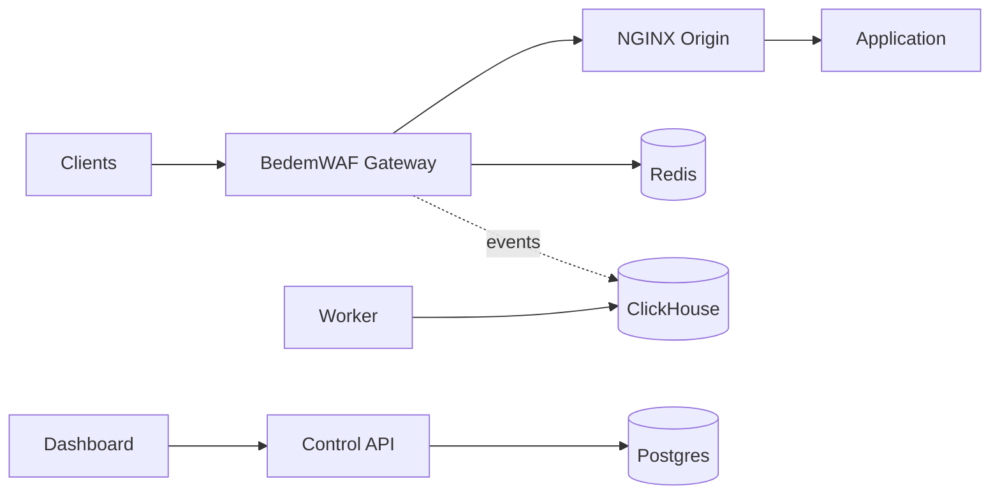

# Deployment Model

BedemWAF is designed to be self-hosted. The gateway sits in front of NGINX
origins, while the control plane manages configuration and events.

## Single-Node Internal Deployment

This is the simplest deployment for internal applications, staging, or small
installations.

```text
                single host or VM

  +----------+     +-------------------+     +--------------+
  | Clients  |---->| BedemWAF Gateway  |---->| NGINX Origin |
  +----------+     +-------------------+     +--------------+
                         |
                         v
        +------------------------------------------+
        | Postgres | Redis | ClickHouse | Worker   |
        | Control API | Dashboard                  |
        +------------------------------------------+
```



Characteristics:

- All services run on one VM or Docker host.
- Good for development and low-risk internal services.
- Not ideal for high availability.
- Backups are required for Postgres and ClickHouse.

MVP support:

- Docker Compose local environment
- HTTP gateway listener
- Manual origin configuration

## Multi-Node Gateway Deployment

In production, multiple gateways can sit behind a load balancer.

```text
                 +----------------+
Internet ------->| Load Balancer  |
                 +---+--------+---+
                     |        |
          +----------+        +----------+
          v                              v
 +-------------------+          +-------------------+
 | Gateway node A    |          | Gateway node B    |
 +---------+---------+          +---------+---------+
           |                              |
           +--------------+---------------+
                          v
                   +--------------+
                   | NGINX Origin |
                   +--------------+

Gateways share:
  - Postgres-backed config through snapshots
  - Redis-backed rate limits
  - ClickHouse audit event storage
```

Characteristics:

- Gateways are stateless except for in-memory policy cache.
- Redis must be shared for global rate limits.
- Each gateway emits events independently.
- Policy revision reporting should identify stale nodes.

MVP support:

- Design-compatible, but not fully automated.

Later phase:

- Health endpoints for load balancers
- Signed snapshot distribution
- Gateway instance inventory
- Kubernetes or systemd deployment examples

## SaaS-Style CNAME Onboarding

BedemWAF can support a SaaS-like onboarding model where customers point
application hostnames at gateway infrastructure.

```text
Customer DNS
  api.customer.com CNAME customer-id.bedemwaf.example
                                  |
                                  v
                          BedemWAF Gateway
                                  |
                                  v
                         Customer NGINX Origin
```

Onboarding steps:

1. Create tenant.
2. Create app with expected hostnames.
3. Create origin pointing to the customer's NGINX endpoint.
4. Start policy in `count` mode.
5. Ask customer to add CNAME.
6. Verify traffic and audit events.
7. Lock origin to gateway addresses.
8. Promote selected protections to `block` mode after review.

MVP support:

- Hostname-based app lookup.
- Manual DNS and origin setup.

Later phase:

- Automated domain verification.
- TLS certificate provisioning.
- Tenant-facing onboarding checks.

## Origin Locking Recommendations

Origin locking ensures attackers cannot bypass BedemWAF by connecting directly
to NGINX.

Recommended controls:

- Allow inbound origin traffic only from gateway IP addresses or private network
  ranges.
- Put origins on private networks when possible.
- Use security groups, firewall rules, or NGINX allow/deny rules.
- Require a gateway-set header only as a secondary signal, not as the only
  control.
- Monitor for direct-to-origin traffic.

Example NGINX concept:

```text
allow <gateway-private-cidr>;
deny all;
```

Do not rely only on a shared secret header if the origin is publicly reachable.
Network-level restrictions are stronger.

## Failure Modes

### Redis Unavailable

Impact:

- Rate limiting cannot reliably count requests.

MVP behavior:

- Fail open by default.
- Emit degraded health and audit events.

Later phase:

- Per-limit fail-open/fail-closed configuration.
- Local emergency counters for short outages.

### Policy Cache Stale

Impact:

- Gateway may enforce an older policy revision.

MVP behavior:

- Continue using last valid snapshot.
- Mark gateway health degraded.
- Include policy revision in audit events.

Later phase:

- Signed snapshots with expiry.
- Control-plane view of stale gateways.

### Origin Unavailable

Impact:

- Allowed traffic cannot reach the application.

MVP behavior:

- Return `502` for connection failures.
- Return `504` for timeouts.
- Emit origin failure event.

Later phase:

- Origin health checks.
- Failover origins.
- Circuit breakers.

### ClickHouse Unavailable

Impact:

- Event storage and search are degraded.

MVP behavior:

- Gateway continues serving traffic.
- Event emitter uses bounded buffering and drops with counters if necessary.
- Dashboard event search reports backend unavailable.

Later phase:

- Durable event queue.
- Replay from object storage or queue.

### Control API Unavailable

Impact:

- Operators cannot change configuration.
- Gateways cannot fetch new snapshots.

MVP behavior:

- Gateways continue using cached policies.
- Dashboard shows API failure.

Later phase:

- Highly available control API deployment.
- Gateway snapshot fallback from local disk.

## Safe Defaults

- New policies start in `count` mode.
- Dashboard is private and authenticated.
- Full request bodies are not logged.
- Sensitive headers and fields are redacted.
- Body inspection size is limited.
- Unknown hosts are rejected.
- Origin lock-down is documented as required production hardening.

## MVP vs Later Phase

MVP:

- Single-node Docker Compose for development
- Manual production deployment guidance
- One or more gateways possible with shared Redis
- Manual CNAME and origin setup
- Basic origin locking documentation

Later phase:

- Kubernetes manifests or Helm chart
- Automated TLS and domain verification
- High-availability deployment guides
- Gateway fleet management
- Durable event pipelines
