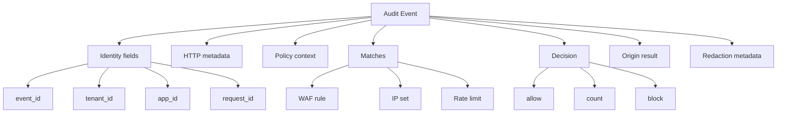

# Event Schema

BedemWAF audit events must be structured, redacted, and useful for both
investigation and analytics. Full sensitive request bodies are not stored by
default.

## Common Fields

- `event_id`: stable unique ID for the audit event
- `timestamp`: RFC 3339 timestamp
- `tenant_id`: tenant that owns the protected app
- `app_id`: protected application ID
- `request_id`: gateway request ID
- `source_ip`: client IP as seen by the gateway
- `http`: normalized request metadata
- `policy`: policy and mode used for evaluation
- `matches`: WAF, IP set, and rate-limit matches
- `decision`: final gateway decision
- `origin`: upstream target metadata for allowed requests
- `redaction`: fields removed or masked before storage



## Count Event Example

```json
{
  "event_id": "evt_01J00000000000000000000001",
  "timestamp": "2026-06-15T10:30:00Z",
  "tenant_id": "ten_demo",
  "app_id": "app_public_api",
  "request_id": "req_01J00000000000000000000002",
  "source_ip": "203.0.113.10",
  "http": {
    "method": "POST",
    "host": "api.example.com",
    "path": "/login",
    "query_redacted": true,
    "user_agent": "ExampleClient/1.0",
    "status": 200
  },
  "policy": {
    "policy_id": "pol_login_protection",
    "mode": "count"
  },
  "matches": [
    {
      "type": "waf_rule",
      "rule_group_id": "crs_owasp",
      "rule_id": "942100",
      "severity": "critical",
      "message": "SQL injection pattern detected"
    }
  ],
  "decision": {
    "action": "count",
    "blocked": false
  },
  "origin": {
    "origin_id": "org_nginx_primary",
    "status": 200
  },
  "redaction": {
    "headers": ["authorization", "cookie"],
    "body_stored": false
  }
}
```

## Block Event Example

```json
{
  "event_id": "evt_01J00000000000000000000003",
  "timestamp": "2026-06-15T10:31:00Z",
  "tenant_id": "ten_demo",
  "app_id": "app_public_api",
  "request_id": "req_01J00000000000000000000004",
  "source_ip": "198.51.100.25",
  "http": {
    "method": "GET",
    "host": "api.example.com",
    "path": "/admin",
    "query_redacted": true,
    "user_agent": "ExampleClient/1.0",
    "status": 403
  },
  "policy": {
    "policy_id": "pol_admin_protection",
    "mode": "block"
  },
  "matches": [
    {
      "type": "ip_set",
      "ip_set_id": "ips_known_bad_sources",
      "cidr": "198.51.100.0/24",
      "message": "Source IP matched blocked range"
    }
  ],
  "decision": {
    "action": "block",
    "blocked": true,
    "reason": "ip_set_match"
  },
  "origin": null,
  "redaction": {
    "headers": ["authorization", "cookie", "x-api-key"],
    "body_stored": false
  }
}
```

## Redaction Rules

Default redaction should include:

- `authorization`
- `cookie`
- `set-cookie`
- `x-api-key`
- access tokens in query parameters
- password-like fields
- full request bodies

TODO:

- Define ClickHouse table schema
- Define event versioning
- Define sampling strategy for high-volume count events
- Define retention defaults
