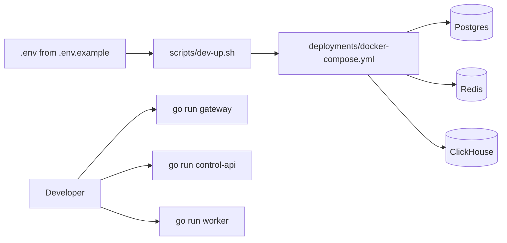

# Local Development

BedemWAF local development uses Docker Compose for shared infrastructure and
direct service execution for early Go and dashboard development.

## Prerequisites

- Docker with Compose support
- Go 1.22 or newer
- Node.js 20 or newer for the dashboard

## Environment

Create a local `.env` from the safe example values:

```bash
cp .env.example .env
```

The example file uses local-only placeholder credentials. Do not reuse them in
shared or production environments.

## Start Dependencies

```bash
./scripts/dev-up.sh
```



This starts:

- Postgres for configuration data
- Redis for rate limiting and short-lived operational state
- ClickHouse for WAF audit events and analytics

Validate Compose manually:

```bash
cd deployments
docker compose config
```

## Run Services

Each Go service currently has a minimal entrypoint that prints its service name
and version. Business logic will be added incrementally.

```bash
go run ./services/gateway/cmd/gateway
go run ./services/control-api/cmd/control-api
go run ./services/worker/cmd/worker
```

## Stop Dependencies

```bash
./scripts/dev-down.sh
```

## Next Implementation Steps

- Add gateway HTTP listener and reverse proxy wiring
- Add control API HTTP router and health endpoints
- Add worker job runner skeleton
- Add database migration tooling
- Add ClickHouse event table initialization
- Scaffold the dashboard with Next.js app files
