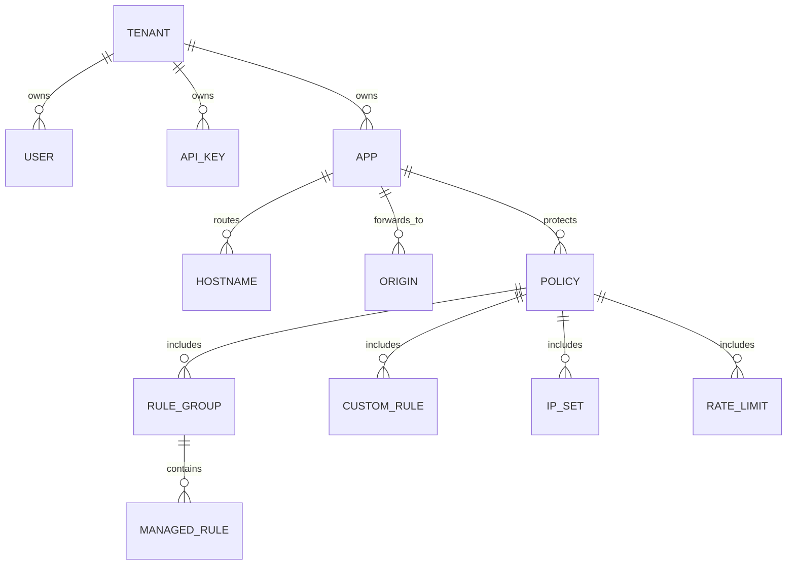

# Policy Model

BedemWAF models configuration as tenant-owned resources. A request is mapped to
an app by hostname, the app points to an active policy, and the policy references
origins, rule groups, custom rules, IP sets, and rate limits.

## Entity Relationship Diagram

```text
Tenant
  |
  +--> User
  +--> API Key
  +--> App
        |
        +--> Hostname
        +--> Origin
        +--> Policy
              |
              +--> Rule Group
              |     |
              |     +--> Managed Rule
              |     +--> Custom Rule
              |
              +--> IP Set
              +--> Rate Limit
```



## Tenant

A tenant is the top-level administrative boundary. All mutable resources belong
to exactly one tenant.

Suggested fields:

- `id`
- `name`
- `status`: `active`, `suspended`, or `deleted`
- `created_at`
- `updated_at`

Implementation notes:

- Every control API query must include tenant scoping.
- Cross-tenant access should be impossible at the database and service layer.
- Event search must filter by tenant before applying user-provided filters.

## App

An app represents a protected HTTP property, usually one or more hostnames that
route through BedemWAF.

Suggested fields:

- `id`
- `tenant_id`
- `name`
- `hostnames`
- `default_origin_id`
- `active_policy_id`
- `created_at`
- `updated_at`

Rules:

- Hostnames must be unique across active apps unless explicit multi-tenant
  routing rules are added later.
- Unknown hosts must not proxy to a fallback origin.
- Apps should start with a default `count` mode policy.

## Origin

An origin is the upstream NGINX endpoint for allowed traffic.

Suggested fields:

- `id`
- `tenant_id`
- `app_id`
- `name`
- `scheme`: `http` or `https`
- `host`
- `port`
- `health_check_path`
- `tls_server_name`
- `connect_timeout_ms`
- `read_timeout_ms`

Implementation notes:

- MVP supports one default origin per app.
- Later phases can add weighted origins, failover, active health checks, and
  per-path routing.
- Operators should configure NGINX or network controls so only BedemWAF gateways
  can reach the origin.

## Policy

A policy is the ordered decision configuration for an app.

Suggested fields:

- `id`
- `tenant_id`
- `app_id`
- `name`
- `mode`: `count` or `block`
- `rule_group_ids`
- `custom_rule_ids`
- `ip_set_ids`
- `rate_limit_ids`
- `enabled`
- `revision`
- `created_at`
- `updated_at`

Mode behavior:

- `count`: record matching rules and intended action, then allow the request.
- `block`: enforce blocking matches unless an allow rule explicitly overrides
  them.

MVP requirements:

- New policies default to `count`.
- A policy revision should be included in gateway snapshots and audit events.
- Disabled policies should never be selected as active policies.

Later-phase requirements:

- Draft policies
- Staged rollout
- Rollback to prior revisions
- Per-rule override actions

## Rule Group

A rule group is an ordered set of managed or custom defensive rules.

Suggested fields:

- `id`
- `tenant_id`
- `name`
- `source`: `managed`, `custom`, or `imported`
- `version`
- `enabled`
- `rule_ids`

MVP:

- Support managed OWASP CRS-compatible rule groups executed by Coraza.
- Store metadata in Postgres and load rule files from trusted local paths or
  bundled images.

Later phase:

- Signed managed rule updates
- Tenant-level rule exclusions
- Per-app anomaly score thresholds

## Custom Rule

A custom rule is a simple defensive predicate controlled by the operator.

Suggested fields:

- `id`
- `tenant_id`
- `name`
- `description`
- `enabled`
- `priority`
- `match_target`: `path`, `method`, `header`, `query`, or `source_ip`
- `operator`: `equals`, `prefix`, `contains`, `regex`, or `cidr_contains`
- `value`
- `action`: `allow`, `count`, or `block`

Implementation notes:

- Regex rules must have timeouts or use a safe regex engine.
- Custom rules must not support exploit generation or active scanning behavior.
- MVP should keep custom rules simple and deterministic.

## IP Set

An IP set is a named collection of CIDR ranges.

Suggested fields:

- `id`
- `tenant_id`
- `name`
- `description`
- `cidrs`
- `action`: `allow`, `count`, or `block`
- `enabled`

Evaluation rules:

- Exact IP/CIDR membership should be evaluated before WAF inspection.
- If both allow and block sets match, MVP should prefer explicit block unless a
  policy-level override is added later.
- IP set matches must be recorded in audit events.

## Rate Limit

A rate limit defines a threshold over a window.

Suggested fields:

- `id`
- `tenant_id`
- `app_id`
- `name`
- `key`: `source_ip`, `host`, `path`, or future composite key
- `limit`
- `window_seconds`
- `action`: `count` or `block`
- `fail_mode`: `open` or `closed`
- `enabled`

MVP implementation:

- Use Redis counters with expiration equal to the configured window.
- Include tenant and app IDs in the Redis key.
- Default `fail_mode` is `open` to avoid outage during Redis incidents.
- Log rate-limit backend failures as audit or health events.

## API Key

API keys authenticate automation against the control API.

Suggested fields:

- `id`
- `tenant_id`
- `name`
- `key_hash`
- `scopes`
- `last_used_at`
- `expires_at`
- `created_at`

Implementation notes:

- Store only hashed keys.
- Show the plaintext key only once at creation.
- Scope keys to specific actions such as `events:read` or `policies:write`.

## Evaluation Order

```text
Resolve app by Host
  |
  v
Load active policy revision
  |
  v
IP sets
  |
  v
Rate limits
  |
  v
Managed WAF rule groups
  |
  v
Custom rules
  |
  v
Apply count/block mode
```

## MVP vs Later Phase

MVP:

- Tenants, apps, origins, policies
- Managed rule group metadata
- Basic custom rules
- IP sets
- Redis-backed rate limits
- API keys with hashed storage

Later phase:

- Fine-grained RBAC
- Policy drafts and approvals
- Rule exclusions and overrides
- Multi-origin routing
- Signed policy snapshots
- Managed rule update channels
