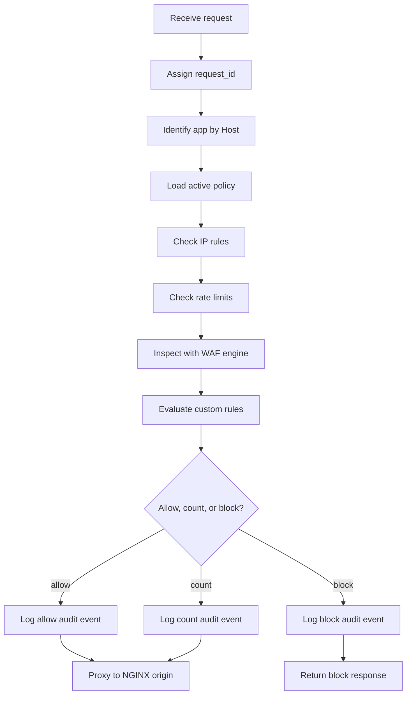

# Request Flow

This document defines the expected request path through the BedemWAF gateway.

## High-Level Flow

```text
Client
  |
  v
BedemWAF Gateway
  |
  +--> request_id
  +--> app lookup by Host
  +--> policy cache lookup
  +--> IP rules
  +--> rate limits
  +--> WAF inspection
  +--> custom rules
  +--> final decision
  |
  +--> audit event
  |
  +--> NGINX Origin or block response
```



## Step-by-Step

### 1. Receive Request

The gateway accepts an HTTP request from a client or upstream load balancer.

MVP requirements:

- Enforce maximum header size using server configuration.
- Enforce maximum request body inspection size.
- Capture request start time.
- Capture remote address.

### 2. Assign `request_id`

Generate a unique request ID if one is not already trusted from an upstream.

Implementation notes:

- Use a collision-resistant ID.
- Add it to the request context.
- Send it to the origin as `X-BedemWAF-Request-ID`.
- Include it in every audit event.

### 3. Identify App by `Host`

Normalize the `Host` header and look up the app.

Behavior:

- Known host: continue.
- Unknown host: return `421` or `404`, emit a minimal event, and do not proxy.

### 4. Load Policy

Load the active policy from the in-memory policy cache.

Behavior:

- If policy exists: continue with its revision.
- If no policy exists: use a safe default deny-or-count behavior defined by app
  configuration. MVP should reject traffic for apps without active policies.
- If cache is stale: continue with last valid policy and emit degraded health
  signal.

### 5. Check IP Rules

Evaluate source IP against policy IP sets.

Behavior:

- In `count` mode, record the match and continue.
- In `block` mode, block if a block IP set matches.
- Allow-list semantics should be explicit. MVP should not let an allow-list
  accidentally bypass WAF inspection unless the policy says so.

### 6. Check Rate Limits

Increment Redis counters for configured limits.

Behavior:

- Under limit: continue.
- Over limit in `count` mode: record and continue.
- Over limit in `block` mode: return `429`.
- Redis unavailable: fail open by default, emit failure event.

### 7. Inspect with WAF Engine

Run Coraza with OWASP CRS-compatible rules.

Behavior:

- Inspect normalized request components.
- Inspect request bodies only up to configured limits.
- Record matched rule metadata.
- Never store full sensitive body data by default.

### 8. Evaluate Custom Rules

Evaluate deterministic custom defensive rules.

Behavior:

- Match only configured fields.
- Record matches and rule IDs.
- Avoid complex scripting or offensive payload behavior.

### 9. Decide Allow, Count, or Block

Combine all matches into one final action.

Decision guidance:

- `allow`: no enforced block decision.
- `count`: one or more rules matched, but policy mode or rule action is count.
- `block`: policy is in block mode and an enforced block condition matched.

### 10. Log Audit Event

Create a structured event before returning the final response.

Requirements:

- Redact sensitive headers and fields.
- Include policy revision.
- Include matched rule IDs.
- Include final action.
- Queue asynchronously with bounded memory.

### 11. Proxy or Return Block Response

Allowed or count-only requests are proxied to the NGINX origin. Blocked requests
receive a defensive response from the gateway.

Response behavior:

- Rate-limit block: `429 Too Many Requests`
- WAF/IP/custom block: `403 Forbidden`
- Unknown host: `421` or `404`
- Origin timeout: `504 Gateway Timeout`
- Origin connection failure: `502 Bad Gateway`

## Sequence Diagram

```text
Client        Gateway          Redis          WAF Engine       Origin      Events
  |              |                |                |              |           |
  | request      |                |                |              |           |
  |------------->|                |                |              |           |
  |              | assign id      |                |              |           |
  |              | lookup app     |                |              |           |
  |              | load policy    |                |              |           |
  |              | rate check     |                |              |           |
  |              |--------------->|                |              |           |
  |              |<---------------|                |              |           |
  |              | inspect        |                |              |           |
  |              |-------------------------------->|              |           |
  |              |<--------------------------------|              |           |
  |              | decide         |                |              |           |
  |              | enqueue event  |                |              |---------->|
  |              | proxy allowed  |                |              |           |
  |              |---------------------------------------------->|           |
  |              |<----------------------------------------------|           |
  | response     |                |                |              |           |
  |<-------------|                |                |              |           |
```

## Safe Defaults

- Default policy mode is `count`.
- Unknown hosts are rejected.
- Body inspection has explicit limits.
- Full body logging is disabled.
- Sensitive headers are redacted.
- Redis failure fails open unless configured otherwise.
- Origin failures return standard gateway errors.

## MVP vs Later Phase

MVP:

- One origin per app
- Host-based routing
- Basic rate limits
- Request WAF inspection
- Basic custom rules
- Asynchronous audit event queue

Later phase:

- Advanced origin selection
- Response inspection
- Per-rule overrides
- Gateway clustering metadata
- Rich tracing and sampling controls
