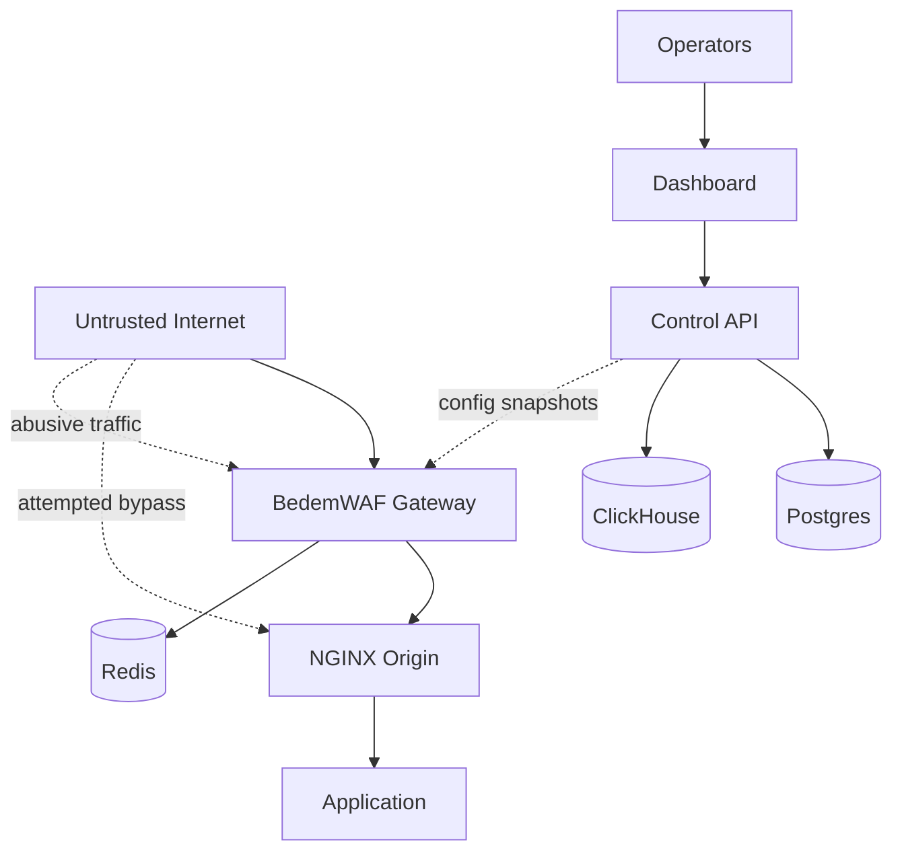

# Threat Model

This document defines the defensive threat model for BedemWAF. BedemWAF is built
to reduce application-layer risk for applications behind NGINX origins. It is
not intended for offensive testing, exploit development, traffic amplification,
or unauthorized scanning.

## Assets

- Origin applications behind NGINX
- Tenant, application, origin, and policy configuration
- WAF rule groups and custom rules
- IP sets and rate-limit definitions
- Audit event data
- Operator credentials and sessions
- Gateway-to-control-plane configuration channel

## Trust Boundaries

```text
Untrusted Internet
  |
  v
BedemWAF Gateway      <-- public traffic boundary
  |
  v
NGINX Origin          <-- origin should only trust gateway traffic
  |
  v
Application

Operators
  |
  v
Dashboard / Control API
  |
  v
Postgres / ClickHouse / Redis
```



## In-Scope Threats

- Common HTTP attacks covered by OWASP CRS-compatible rules
- Attempts to bypass origin protections by reaching the NGINX origin directly
- Excessive request rates against protected apps
- Malicious client IPs or networks already known to operators
- Unsafe policy changes that block legitimate users without count-mode review
- Audit log leakage of sensitive request data
- Control API input validation failures
- Dashboard/API session and browser security weaknesses

## Out-of-Scope Threats

- L3/L4 volumetric DDoS attacks
- CDN cache poisoning, because BedemWAF is not a CDN
- Malware analysis and exploit generation
- Offensive scanning or vulnerability discovery of third-party systems
- Full compromise of the host running BedemWAF
- Physical attacks on infrastructure

## Defensive Controls

- Count mode before block mode for new or risky rules
- Explicit block mode only after operator review
- Request body size limits in the gateway
- Redaction of sensitive headers, cookies, tokens, and request fields
- No full request body storage by default
- Origin lock-down guidance so origins accept traffic only from gateways
- Structured audit events with stable IDs for investigation
- Input validation for every control API request
- Secure dashboard and API headers
- No committed secrets

## Abuse Prevention

BedemWAF must not include features that make offensive activity easier. Future
features should be reviewed against these rules:

- Do not add exploit payload generators
- Do not add internet-wide scanning workflows
- Do not add automated attack replay tools
- Do not expose raw sensitive request bodies unless an operator deliberately
  enables a narrow, time-limited diagnostic mode

## Open TODOs

- Define authentication and authorization model
- Define gateway configuration distribution security
- Define audit event retention defaults
- Add origin lock-down examples for common cloud providers
- Add incident response runbooks for false positives and active blocking
